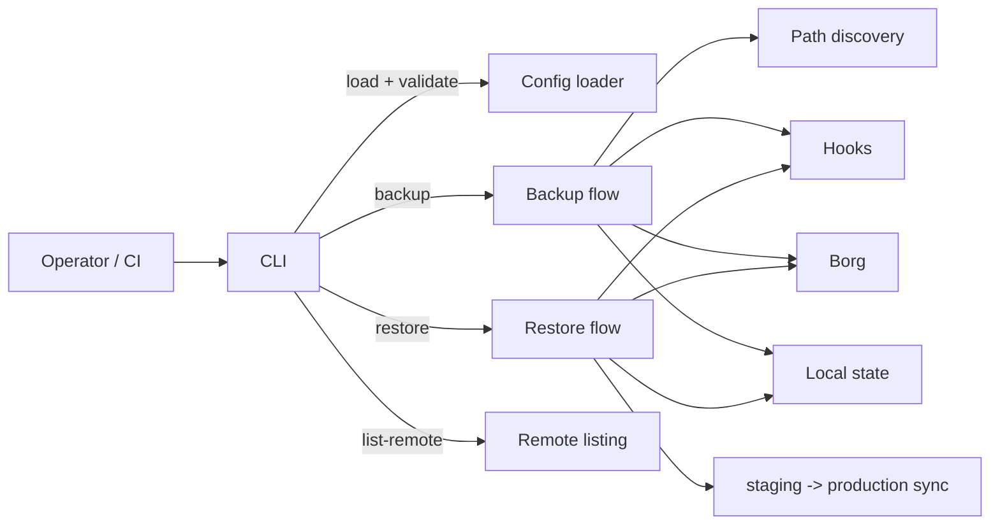

# Project Overview

Backups Server is a small, opinionated Python CLI that discovers important host paths for Docker
Compose-deployed services and stores incremental, deduplicated snapshots in a remote Borg
repository over SSH. It focuses on a predictable operator workflow (validate config → run backups →
restore to staging/production), with per-service pre/post hooks and a minimal local state store to
track the last successful archive.

## Repository Structure

- [`.vscode/`](.vscode/launch.json:1) — local editor/debug configuration for VS Code.
- [`docs/`](docs/architecture.md:1) — architecture, configuration reference, and implementation-detail guides.
- [`tests/`](tests/test_cli.py:1) — pytest-based unit/integration tests plus fixtures.
- [`AGENTS.md`](AGENTS.md:1) — agent-facing repository playbook (this file).
- [`.gitignore`](.gitignore:1) — git ignore rules (includes local config and state).
- [`backup_tool.py`](backup_tool.py:1) — CLI entrypoint and argument parsing.
- [`backup_flow.py`](backup_flow.py:1) — backup orchestration (discovery → hooks → borg → state).
- [`restore_flow.py`](restore_flow.py:1) — restore orchestration (resolve latest → hooks → extract → optional mirror).
- [`config_loader.py`](config_loader.py:1) — YAML config loading + strict validation.
- [`docker_introspect.py`](docker_introspect.py:1) — compose/env/path discovery and volume resolution.
- [`borg.py`](borg.py:1) — Borg command construction and execution helpers.
- [`remote_listing.py`](remote_listing.py:1) — `list-remote` normalization, filtering, grouping, and rendering.
- [`commands.py`](commands.py:1) — hook execution primitives for per-service commands.
- [`state_store.py`](state_store.py:1) — per-service local state persistence under `.backup-state/`.
- [`errors.py`](errors.py:1) — custom exception types for config errors.
- [`requirements.txt`](requirements.txt:1) — runtime Python dependencies.
- [`README.md`](README.md:1) — operator/developer overview and usage examples.

## Build & Development Commands

> TODO: This repo does not define dedicated `lint`, `type-check`, or `deploy` scripts. If you add
> them, update this section and keep commands stable for CI.

### Install

```bash
python -m venv .venv
source .venv/bin/activate
pip install -r requirements.txt

# optional: install as a package/entrypoint
pip install .
```

### Run (CLI)

```bash
# Show help
python backup_tool.py --help

# If installed as a console script (example name from README)
./backup-cli --help

# Validate a config
python backup_tool.py --config ./config.yaml.example validate

# Backup all services (README contains an older form without --all)
python backup_tool.py --config ./config.yaml.example backup

# Backup all services (current CLI requires an explicit selector)
python backup_tool.py --config ./config.yaml.example backup --all

# Backup a single service
python backup_tool.py --config ./config.yaml.example backup --service nextcloud

# List remote archives (TSV)
python backup_tool.py --config ./config.yaml.example list-remote

# Restore latest snapshot for a service into staging
python backup_tool.py --config ./config.yaml.example restore --service nextcloud --latest --staging-dir /tmp/restore
```

### Test

```bash
python -m pytest -q
```

### Lint

```bash
> TODO: Add a linter (for example ruff) and document the exact command.
```

### Type-check

```bash
> TODO: Add a type checker (for example mypy/pyright) and document the exact command.
```

### Debug

```bash
> TODO: Document a supported debug workflow.
> Suggested starting point: VS Code launch configuration in [`.vscode/launch.json`](.vscode/launch.json:1).
```

### Deploy

```bash
> TODO: Document a supported deployment target (systemd unit, container image, etc.).
```

## Code Style & Conventions

### Formatting and naming

- Python: follow standard PEP 8 conventions; keep functions small and readable.
- Prefer explicit, user-facing error messages for config/CLI failures.
- Keep CLI output script-friendly (TSV has no header and no decorative text).

> TODO: There is no formatter/linter config committed (no ruff/black/isort config found). If you
> add one, document the tool + version + exact command.

### Configuration conventions

- The config schema is documented in [`docs/configuration-syntax.md`](docs/configuration-syntax.md:1)
  and validated by [`config_loader.load_config()`](config_loader.py:75).
- Local operator config is typically [`config.yaml`](config.yaml:1) and is gitignored in
  [`.gitignore`](.gitignore:178).

### Commit message template

> TODO: No commit-message standard is defined in-repo. Recommended template:
>
> 1. `<area>(specific component): <imperative summary>`
> 2. `\n\nWhy: <reason>`
> 3. `How: <high-level approach>`
> 4. `Refs: <issue/doc link>`

## Architecture Notes



Primary control/data flow during backup:

1. The CLI entrypoint [`backup_tool.main()`](backup_tool.py:33) loads and validates config via
   [`config_loader.load_config()`](config_loader.py:75).
2. Backup orchestration is performed by [`backup_flow.backup_all_services()`](backup_flow.py:155)
   and [`backup_flow.backup_service()`](backup_flow.py:40):
   1. Discovery via [`docker_introspect.discover_paths()`](docker_introspect.py:198) (compose file,
      env files, extra paths, and host-side mounts from `services.*.volumes`).
   2. Pre-hooks via [`commands.run_hooks()`](commands.py:87) (fail-fast).
   3. Snapshot via [`borg.run_borg_create()`](borg.py:426) (executes `borg create` remotely over
      SSH).
   4. Post-hooks via [`commands.run_hooks()`](commands.py:87) (attempted even when borg fails).
   5. State update via [`state_store.update_last_success_archive()`](state_store.py:94) into
      [`.backup-state/<service>.json`](state_store.py:26) (directory is gitignored; see
      [`.gitignore`](.gitignore:179)).
3. Remote archive listing is built from [`borg.run_borg_list_archives()`](borg.py:224) and
   processed/rendered by [`remote_listing.process_remote_archives()`](remote_listing.py:464),
   [`remote_listing.render_tsv()`](remote_listing.py:351), and
   [`remote_listing.render_json()`](remote_listing.py:377).
4. Restore orchestration in [`restore_flow.restore_service()`](restore_flow.py:156) resolves the
   requested archive (including latest resolution in
   [`restore_flow.resolve_latest_archive_name()`](restore_flow.py:106)), runs hooks, extracts via
   [`borg.run_borg_extract()`](borg.py:393), and can optionally mirror staging to a production path
   when `restore_paths` is configured.

Implementation-level rationale and sequences are documented in
[`docs/architecture.md`](docs/architecture.md:1).

## Testing Strategy

Tools

- Test runner: `pytest` (invoked as `python -m pytest -q` in [`README.md`](README.md:192)).
- Primary style: fast unit tests with monkeypatching for external effects (Borg, filesystem,
  subprocess).

Local runs

```bash
python -m pytest -q
```

What is covered (high-level)

- CLI behavior:
  - `validate` is exercised via subprocess in [`tests/test_cli.py`](tests/test_cli.py:20).
  - `backup` behavior is tested by calling [`backup_tool.main()`](backup_tool.py:33) with
    monkeypatched [`backup_flow.backup_all_services()`](backup_flow.py:155) to avoid Borg
    dependency in unit tests.
- Orchestration semantics:
  - Backup flow tests in [`tests/test_backup_flow.py`](tests/test_backup_flow.py:1) typically
    monkeypatch the functions imported into [`backup_flow.backup_service()`](backup_flow.py:40)
    (for example [`borg.run_borg_create()`](borg.py:426)).

CI

> TODO: No CI workflow files are present in the provided tree. If CI is added, keep `python -m
> pytest -q` as the baseline contract unless a replacement is documented.

## Security & Compliance

Secrets handling

- The config requires `borg.passphrase` to be present and non-empty (validated by
  [`config_loader.get_borg_passphrase()`](config_loader.py:289)), and is passed to Borg via
  `BORG_PASSPHRASE` in [`borg.build_borg_environment()`](borg.py:115).
- Local operator config ([`config.yaml`](config.yaml:1)) is gitignored in [`.gitignore`](.gitignore:178),
  but it may still exist on disk; treat it as sensitive.

> TODO: Consider supporting passphrase injection via environment variables or a secrets manager so
> the passphrase does not need to live in plaintext YAML.

Remote access guardrails

- SSH is invoked with non-interactive options (`BatchMode=yes`, timeouts) and accepts new host keys
  by default in [`borg.build_borg_environment()`](borg.py:115).
- Recommended: restrict the storage-host `authorized_keys` entry to `borg serve` (operator guidance
  in [`docs/storage-setup.md`](docs/storage-setup.md:36)).

Hooks

- Backup/restore hooks are executed via the shell in [`commands.run_command()`](commands.py:23), which
  is convenient but increases risk if configuration is untrusted.

Dependency and license notes

- Runtime dependency is declared in [`requirements.txt`](requirements.txt:1).

> TODO: No dependency-scanning (SCA) configuration is present in the provided tree.
> TODO: A `LICENSE` file was not present in the provided tree; confirm repository license policy.

## Agent Guardrails

Scope boundaries for automated changes

1. Do not modify local/operator state or secrets:
   - [`config.yaml`](config.yaml:1) (gitignored; likely contains real hosts/keys/passphrases) per
     [`.gitignore`](.gitignore:178).
   - `.backup-state/` (runtime state) per [`.gitignore`](.gitignore:179).
   - Any private keys referenced by config (for example `storage_box.ssh_key_path`).
2. Avoid edits that change operator-facing behavior without explicit approval:
   - CLI contract in [`backup_tool.main()`](backup_tool.py:33) (flags, exit codes, output formats).
   - TSV/JSON listing schema in [`remote_listing.render_json()`](remote_listing.py:377) and
     [`remote_listing.render_tsv()`](remote_listing.py:351).
3. External command execution:
   - Treat hook commands as untrusted input; do not broaden execution privileges.
4. Documentation-first for behavior changes:
   - Update [`README.md`](README.md:1) and the relevant docs in [`docs/`](docs/architecture.md:1)
     when changing config schema or flows.

Required reviews (recommended)

> TODO: No CODEOWNERS/review policy is present. Recommended required-review areas:
> 1) Borg invocation and env handling in [`borg.py`](borg.py:1)
> 2) Hook execution in [`commands.py`](commands.py:1)
> 3) Config validation changes in [`config_loader.py`](config_loader.py:1)

Rate limits / safety

- Do not introduce retry loops that can hammer a storage host; keep network operations bounded.
- Keep log output bounded; Borg output is tailed in
  [`borg._run_process_streaming_output()`](borg.py:25).

## Extensibility Hooks

Configuration-driven extension points

- Per-service hooks:
  - Backup: `services[].backup_commands.pre/post` executed via
    [`commands.run_hooks()`](commands.py:87) from [`backup_flow.backup_service()`](backup_flow.py:40).
  - Restore: `services[].restore_commands.pre/post` executed via
    [`commands.run_hooks()`](commands.py:87) from [`restore_flow.restore_service()`](restore_flow.py:156).
- Archive naming:
  - Controlled by `borg.archive_name_template` (see schema in
    [`docs/configuration-syntax.md`](docs/configuration-syntax.md:44)).
- Borg flags and performance:
  - `borg.extra_args`, `borg.files_cache`, and `compression.*` are used when building commands in
    [`borg.build_borg_create_command()`](borg.py:313).
- Restore path mapping:
  - `services[].restore_paths` is parsed by
    [`config_loader.parse_restore_path_mapping()`](config_loader.py:47) and enables `${STAGING_PATH}`
    and `${PRODUCTION_PATH}` substitutions during restore in
    [`restore_flow.restore_service()`](restore_flow.py:156).

Environment variables

- Borg environment variables are set in [`borg.build_borg_environment()`](borg.py:115):
  - `BORG_RSH` (SSH command + key/port)
  - `BORG_PASSPHRASE`
  - `BORG_RELOCATED_REPO_ACCESS_IS_OK`, `BORG_HOST_KEY_IS_OK`

Feature flags

> TODO: No explicit feature-flag system is implemented.

## Further Reading

- High-level architecture: [`docs/architecture.md`](docs/architecture.md:1)
- Config schema and examples: [`docs/configuration-syntax.md`](docs/configuration-syntax.md:1)
- Storage box/operator setup: [`docs/storage-setup.md`](docs/storage-setup.md:1)
- Implementation guide index: [`docs/implementation-guide.md`](docs/implementation-guide.md:1)
- Implementation details:
  - Backup flow: [`docs/implementation-details/backup-flow.md`](docs/implementation-details/backup-flow.md:1)
  - Borg wrapper: [`docs/implementation-details/borg.md`](docs/implementation-details/borg.md:1)
  - Hook execution: [`docs/implementation-details/commands.md`](docs/implementation-details/commands.md:1)
  - Compose discovery: [`docs/implementation-details/docker-introspect.md`](docs/implementation-details/docker-introspect.md:1)
  - Remote listing: [`docs/implementation-details/remote-listing.md`](docs/implementation-details/remote-listing.md:1)
  - State store: [`docs/implementation-details/state-store.md`](docs/implementation-details/state-store.md:1)
