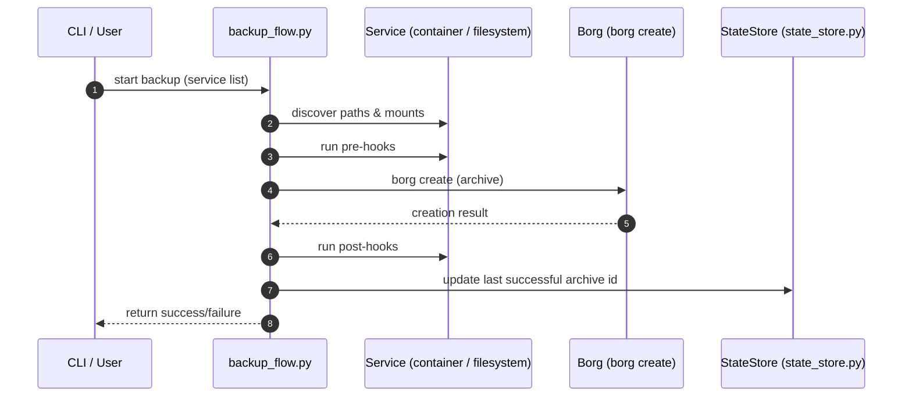

# Architecture overview

This project provides a small, opinionated backup tool that discovers important files and directories from Docker Compose services and stores incremental snapshots in remote Borg repositories over SSH. The implementation added in Phase 2 performs direct, incremental snapshots using `borg create` and supports per-service hooks and simple local state tracking.

High-level components:

- Source server: runs Docker Compose services whose data is to be backed up.
- Backup application: the Python CLI that discovers paths, runs hooks, invokes Borg, and persists local state.
- Storage Box: remote host exposing a Borg repository over SSH (key-based access is required).

This document describes the components, responsibilities, and the control/data flow during a backup run.

# Components and responsibilities

CLI and orchestration
- `backup_tool.py` (CLI entrypoint) — provides subcommands like `validate`, `backup`, `restore`, and `list-remote`. In Phase 2 the `backup` subcommand runs the full orchestration implemented in [`backup_flow.py`](backup_flow.py:1).

Discovery and I/O
- [`docker_introspect.py`](docker_introspect.py:1) — discovers filesystem paths to include in a backup. It reads the configured `compose_file`, any `env_files`, `extra_paths`, and extracts host-side bind mounts from `services.*.volumes` in the compose YAML. The module returns a deduplicated list of absolute paths.

Hook execution
- [`commands.py`](commands.py:1) — provides `run_command(command: str)` and `run_hooks(commands: List[str], phase: str) -> bool`. Hooks are executed as shell commands (currently `shell=True` for convenience with user-provided strings). Pre-hooks are fail-fast; post-hooks are attempted regardless of borg result.

Borg wrapper
- [`borg.py`](borg.py:1) — builds and executes `borg create` invocations. It constructs the repository URL from `config["storage_box"]`, applies compression options, includes extra borg args, and sets `BORG_RSH` to ensure SSH uses the configured identity key and port. `run_borg_create` returns (True, archive_name) on success and (False, None) on failure; stdout/stderr are logged.

Local state
- [`state_store.py`](state_store.py:1) — simple local state persisted per service under `.backup-state/{service}.json`. The state includes `last_success_archive` and `last_success_time` (ISO timestamp). Writes are atomic and read/write helpers are provided.

Orchestration
- [`backup_flow.py`](backup_flow.py:1) — ties the pieces together with `backup_service(config, service_config) -> bool` and `backup_all_services(config) -> Dict[str,bool]`. The canonical sequence is: discovery → pre-hooks → borg.create → post-hooks → state update.

# Backup run sequence (step-by-step)

1. CLI invokes `backup_flow.backup_all_services(config)` which iterates configured services.
2. For each service, `backup_service` determines the `service_name` and calls `docker_introspect.discover_paths(service_config)` to get a deduplicated list of host paths to include.
3. `backup_service` runs pre-hooks by calling `commands.run_hooks(pre_cmds, "pre")`. Note: in Phase 2 pre-hooks are *always invoked* logically (the code calls `run_hooks` with an empty list when no pre commands are configured — empty lists are no-ops). Pre-hook failures are treated as fatal and abort the backup for that service.
4. `backup_service` invokes `borg.run_borg_create(config, service_name, paths)` which executes `borg create` directly against the repository using the configured SSH key via `BORG_RSH`. A successful call returns `(True, archive_name)`; failures return `(False, None)`.
5. Regardless of borg success, `backup_service` calls `commands.run_hooks(post_cmds, "post")` — post-hooks are attempted even if the backup failed. Post-hook failures are logged and do not change the success state returned by `backup_service` if the borg step already failed (but they are recorded via logs and can be included in state metadata in future iterations).
6. If borg succeeded, `backup_service` calls `state_store.update_last_success_archive(service_name, archive_name)` to persist the artifact identifier. An inability to persist state is treated as an overall failure for the service.

# Error handling and semantics

- Pre-hook failures: considered fatal for that service; the backup run for that service aborts and returns `False`.
- Borg failures: logged and returned as failure for the service. Post-hooks are still attempted after borg failures.
- Post-hook failures: logged and do not change the `borg` success/failure result. Operators should inspect logs or state metadata to detect post-hook issues.
- State persistence failures: treated as fatal for a successful borg run (i.e., if borg succeeds but state cannot be persisted, the overall service result is reported as failure to surface the persistence problem).
- Failures are logged with stack traces for diagnostic purposes; callers should examine log output for details.

# Operational considerations

- Logging: the application uses Python logging. Configure logging to capture INFO and DEBUG for troubleshooting. Hook outputs (stdout/stderr) are logged at DEBUG level.
- Permissions: ensure the process can read all paths discovered by `docker_introspect.py` and that the SSH key specified in `storage_box.ssh_key_path` has restrictive filesystem permissions (e.g., 0600).
- Environment for hooks: hooks run with the environment inherited from the process. If hooks depend on PATH or other vars, ensure they are set in the systemd unit or wrapper script.
- Borg SSH settings: `BORG_RSH` is set by the borg wrapper to include `-i <ssh_key>` and `-p <port>` when configured. Host key verification uses `-o StrictHostKeyChecking=accept-new` by default.
- Security: because hooks are executed via shell, configuration that accepts arbitrary user input should be treated with caution. Avoid shell expansion of untrusted data.
- Resumption and retries: the tool records `last_success_archive` and timestamp. Retry/backoff strategies are applied only for network operations in future iterations; current Phase 2 focuses on robust execution and clear error reporting.

# Where to look next

- Implementation and test coverage: core orchestration behavior is located in [`backup_flow.py`](backup_flow.py:1) and validated by [`tests/test_backup_flow.py`](tests/test_backup_flow.py:1).
- Low-level helpers: [`commands.py`](commands.py:1), [`borg.py`](borg.py:1), [`docker_introspect.py`](docker_introspect.py:1), and [`state_store.py`](state_store.py:1).
